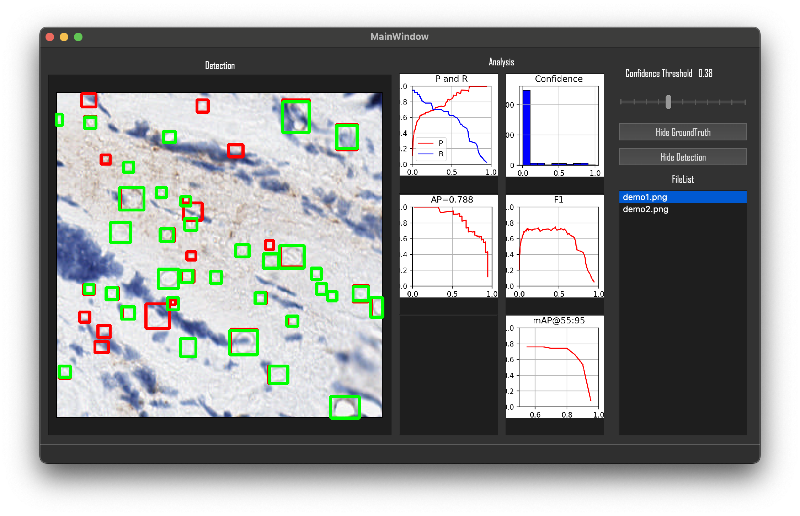

# YOLOResultVisualizationTool

## Introduction
This software is capable of displaying YOLO results in different regions. It can simultaneously calculate the detection results and various metrics for the image. You can drag the confidence threshold bar to dynamically display information such as True Positive and False Positive.

## Environment
This software can run on both Windows and macOS platforms.
Ｗe recommend you use Anaconda to set up your environment.

```
conda create --name YOLOResultVisualizationTool python
conda activate YOLOResultVisualizationTool
conda install -c anaconda pyqt
conda install -c conda-forge opencv
pip install -r requirements.txt
```

## Data Path
This is our file structure.
```
.
├── README.md
├── YOLOResultVisualizationTool
│   ├── __init__.py
│   ├── __main__.py
│   ├── ctrls
│   │   └── controller.py
│   ├── dataset
│   │   ├── image
│   │   │   ├── demo1.png
│   │   │   └── demo2.png
│   │   └── label
│   │       ├── detect
│   │       │   ├── demo1.txt
│   │       │   └── demo2.txt
│   │       └── groundtruth
│   │           ├── demo1.txt
│   │           └── demo2.txt
│   ├── utils
│   │   ├── cal.py
│   │   └── plot.py
│   └── views
│       └── Ui_MainWindow.py
├── img
│   ├── demo.png
│   └── demo_gif.gif
└── requirements.txt

11 directories, 16 files
```
Please put your images in ``YOLOResultVisualizationTool/dataset/image/`` ,your bbox detected labels in ``YOLOResultVisualizationTool/dataset/label/detect/`` and grounded labels in ``OLOResultVisualizationTool/dataset/label/grondtruth/``. Remind to keep the same file name.

## Demo
```
python YOLOResultVisualizationTool
```

- Left view shows the detection with red grounded labels and green detected labels.
- Right view shows the metrics for evaluating the model, including PR curve, F1-score curve, AP, mAP and confidence score distribution.
- and you can choose what images you want show in specific directory.
- You can drag the confidence bar to set threshold.

